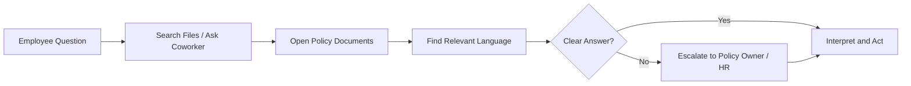

# Current Process Flow

```mermaid
flowchart LR
    A[Employee Question] --> B[Search Files / Ask Coworker]
    B --> C[Open Policy Documents]
    C --> D[Find Relevant Language]
    D --> E{Clear Answer?}
    E -- Yes --> F[Interpret and Act]
    E -- No --> G[Escalate to Policy Owner / HR]
    G --> F
```
