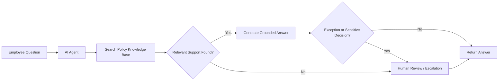

# Automated Process Flow

```mermaid
flowchart LR
    A[Employee Question] --> B[AI Agent]
    B --> C[Search Policy Knowledge Base]
    C --> D{Relevant Support Found?}
    D -- Yes --> E[Generate Grounded Answer]
    D -- No --> F[Human Review / Escalation]
    E --> G{Exception or Sensitive Decision?}
    G -- No --> H[Return Answer]
    G -- Yes --> F
    F --> H
```
