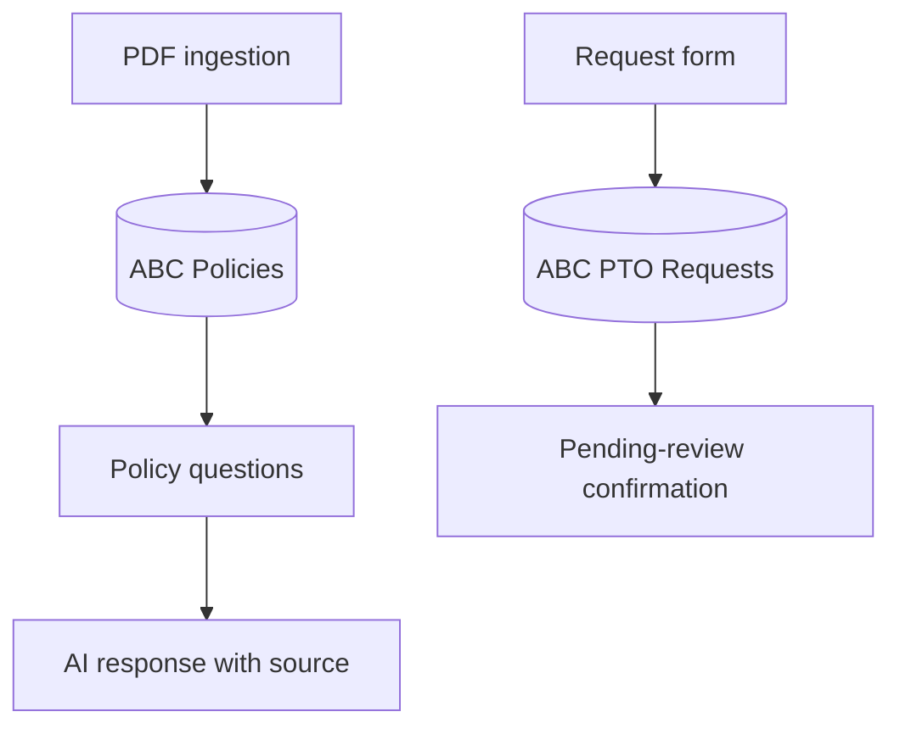

# Architecture

Three separate workflows share persistent n8n Data Tables.

Ingestion uses a fixed `abc-pto` key and upsert. Questions retrieves one policy row and supplies the complete stored text in the system prompt. The user prompt directly references the Chat Trigger, since a table lookup replaces the current item's fields. Routing uses deterministic code and a separate form, assigning exceptions to HR and other submitted types to Manager. The form dropdown limits expected types, but the code lacks an explicit unknown-type rejection.

The model has no tools or memory connected. It cannot write requests or approve them. Human review remains outside the implementation.
